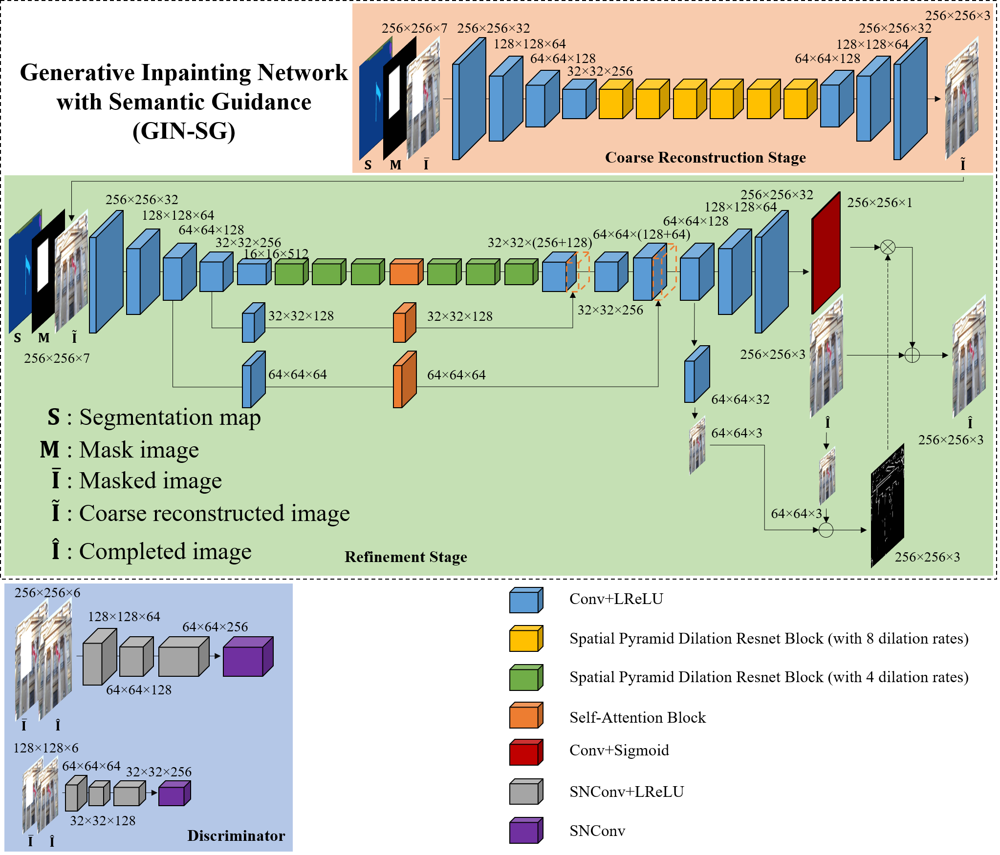
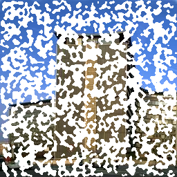
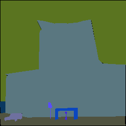
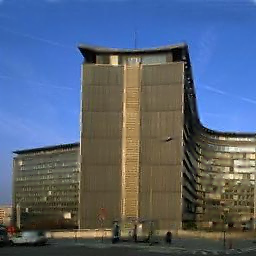

# Deep Generative Inpainting Network with Semantic Guidance (GIN-SG) for Extreme Image Inpainting 
For AIM2020 ECCV Extreme Image Inpainting Track 2 Semantic Guidance <br> 
This is the Pytorch implementation of our Deep Generative Inpainting Network with Semantic Guidance (GIN-SG) for Extreme Image Inpainting. We have participated in AIM 2020 ECCV Extreme Image Inpainting Challenge. Our GIN is used for reconstructing a completed image with satisfactory visual quality from a randomly masked image. <br><br> 

## Overview
<p align='center'>  
  
</p>

## Example of Image Inpainting using our GIN-SG 
- An example from the validation set of the AIM20 ECCV Extreme Image Inpainting Track 2 Semantic Guidance
- (left: masked image, middle: segmentation map, right: our completed image) 
<p align='center'>  
  
  
  
</p>

## Preparation 
- Our solution is developed using Pytorch 1.5.0 platform 
- We train our model on two NVIDIA GeForce RTX 2080 Ti (with 11GB memory) 
- Apart from Pytorch and related dependencies, 
- Install natsort
```bash
pip install natsort
```
- Install dominate 
```bash
pip install dominate
```
- Install scipy 1.1.0
```bash
pip install scipy==1.1.0
```
- If you would like to use tensorboard for logging, please also install tensorboard and tensorflow 
- Please clone this project: 
```bash
git clone https://github.com/rlct1/gin-sg.git
cd gin-sg
```

## Testing 
- An example of the validation data of this challenge is provided in the `datasets/ade20k/test` folder 
- Please download our trained model for this challenge [here](https://drive.google.com/file/d/1qPgJvPl0QEjzKhv6OFwzTe3_jzv2tjo6/view?usp=sharing) (google drive link), and put it under `checkpoints/gin_sg/`
- For reproducing the test results for this challenge, please put all the testing images under `datasets/ade20k/test/`
- You can test our model by typing: 
```bash
python test_ensemble.py --name gin_sg 
```
- The test results will be stored in `results/test` folder 
- If you would like to test on other datasets, please refer to the file structure in the `datasets/ade20k/test` folder 
- Note that the file structure is for AIM20 IC Track 2 
- You can download our test results for this challenge [here](https://drive.google.com/file/d/1ae15B3QRNNvHOUebsWLN9_ipGrnEjFec/view?usp=sharing) (google drive link)

## Training 
- By default, our model is trained using two GPUs 
- Examples of the training images from this challenge is provided in the `datasets/ade20k/train` folder 
- If you would like to train a model using our warm up for initialization, please download our warm up for this challenge [here](https://drive.google.com/file/d/1wtDQwI9TGsKB9ZJGO3velNz3HhpPmFUg/view?usp=sharing) (google drive link), and put it under `checkpoints/warmup/`
```bash
python train.py --name yourmodel --continue_train --load_pretrain './checkpoints/warmup' 
```
- If you would like to train a model from scratch, 
```bash
python train.py --name yourmodel 
```
- If you would like to train a model based on your own selection and resources, please refer to the `options/base_options.py` and `options/train_options.py` for details 

## Acknowledgment 
Our code is developed based on the skeleton of the Pytorch implementation of [pix2pixHD](https://github.com/NVIDIA/pix2pixHD)

